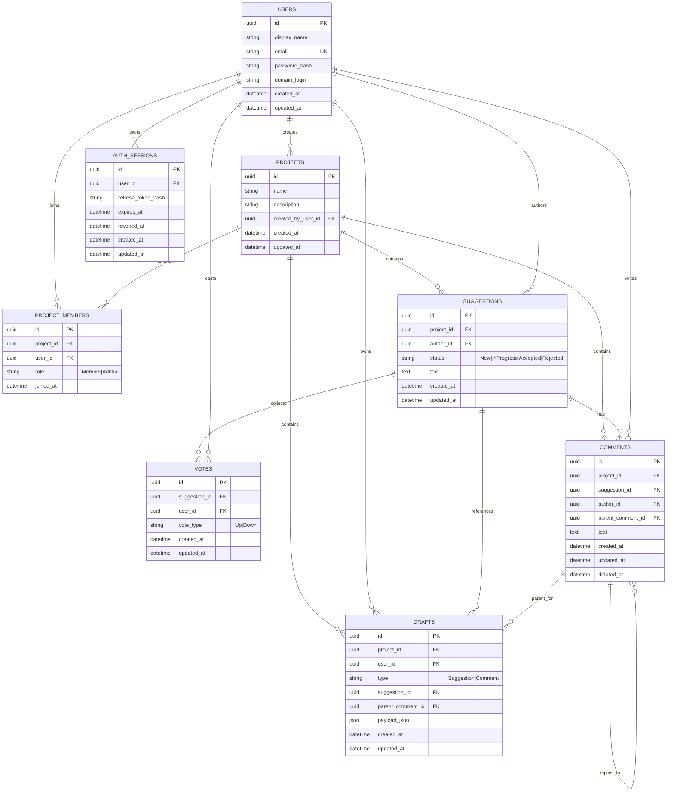

# ER-диаграмма

## Ограничения модели

- Роль администратора хранится в `PROJECT_MEMBERS`, отдельная таблица `project_admins` не требуется.
- На пару `project_id + user_id` в `PROJECT_MEMBERS` действует ограничение уникальности.
- На пару `suggestion_id + user_id` в `VOTES` действует ограничение уникальности.
- `score` предложения не хранится отдельно и вычисляется как производная величина из активных голосов.
- `score = количество голосов Up - количество голосов Down`.
- Для учебного MVP локальная авторизация использует `password_hash` в `USERS`, а не пароль в открытом виде.
- Для корневого комментария `parent_comment_id = null`.
- Для черновика предложения `suggestion_id` и `parent_comment_id` могут быть `null`.
- Для черновика комментария обязательно хранить `suggestion_id`, а `parent_comment_id` заполняется только для ответа.
- Refresh token не хранится в открытом виде и должен быть привязан к `AUTH_SESSIONS`.
- Для MVP допускается только одна активная refresh-сессия на пользователя.
